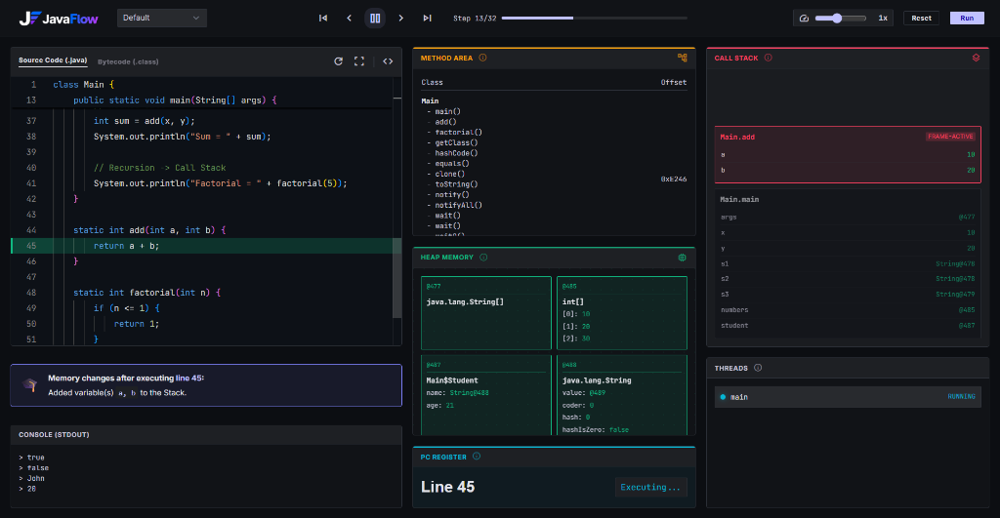

<div align="center">
  
</div>

# JavaFlow (formerly JVM Visualizer)

<div align="center">
  
</div>

**JavaFlow** is a step-by-step visualizer for actual Java program execution. It gives you a real-time, interactive look into the JVM's memory and execution model: **Heap Memory, Method Area, Call Stack, PC Register, and Threads**.

Write Java code, hit **Run**, and you can play, pause, or scrub through execution step-by-step. Watch objects get allocated in the Heap, strings populate the String Pool, stack frames push and pop, variables mutate, and threads execute—all with ground-truth accuracy.

---

## 🚀 In-Depth Features

### 1. Ground-Truth Bytecode Execution (JDI)
JavaFlow is not a language simulator or a toy interpreter. It utilizes the **Java Debug Interface (JDI)** to attach to a true running JVM instance. This means your code behaves exactly as it would in production: standard library calls work, true object references are tracked, arrays behave natively, and exceptions are real JVM events.

### 2. Comprehensive Memory Visualization
*   **Call Stack (JVM Stacks)**: Tracks active frames in real-time. Visually pushes and pops frames upon method entry/exit. Monitors local variables, primitive values, and object references (`@id`), handling method scope correctly.
*   **Heap Memory**: Visualizes object allocation. Tracks fields and nested references. It even visually flags objects that have become unreachable and are ready for **Garbage Collection (GC)**.
*   **String Pool**: Demonstrates Java's string interning optimization by capturing String literal allocations in a dedicated pool view, separating them from standard Heap objects.
*   **Method Area**: Displays dynamically loaded classes and their internal runtime structures (methods, fields, and constructors) along with simulated memory offsets.
*   **PC Register**: Tracks the currently executing instruction line, providing visual context of the program counter per thread.
*   **Threads**: Monitors active threads and their execution states (e.g., Running, Suspended), highlighting the currently active thread during execution steps.

### 3. Interactive Code & Playback Tools
*   **Timeline Scrubber**: Execution is captured as a fully deterministic trace timeline. You can play, pause, step forward, step backward, or drag the scrubber slider to instantly jump to any moment in the program's lifecycle.
*   **Bytecode Viewer**: Switch between your source code (`.java`) and the compiled bytecode (`.class`) output (generated via `javap`) to see how high-level Java translates to low-level JVM instructions.
*   **Console Output**: Standard output (`System.out.print`) is captured and synchronized with the exact step it occurred in the timeline.

### 4. Robust Crash & Exception Handling
*   If your code throws a runtime exception (e.g., `NullPointerException`), JavaFlow catches it and highlights the crash gracefully in the UI.
*   **Infinite Loop Protection**: Implements a maximum frame depth (simulating `StackOverflowError` after 50 recursive calls) and a maximum event count to prevent infinite loops from crashing the server, allowing you to visualize exactly *why* and *how* the overflow occurred.

### 5. Educational Context
*   Every visualization panel features an **Info Overlay**. Clicking the `info` icon provides detailed, educational explanations of how that specific component operates within the Java Virtual Machine specification.

---

## 🛠️ Architecture

JavaFlow is architected with a strict separation of concerns, communicating via a unified JSON trace format.

### 1. The Backend (Node.js Express API)
The backend acts as the orchestrator. When a user submits code via the UI, `server.js`:
1.  Saves the incoming code to a temporary `Main.java` file.
2.  Invokes `javac` to compile the file into `Main.class`.
3.  Invokes `javap -c` to extract the compiled bytecode.
4.  Executes the Java tracer: `java TraceGenerator Main`.
5.  Captures the standard output of the tracer (a massive JSON array representing the timeline of states) and returns it alongside the bytecode to the frontend.
6.  *Safety Mechanism*: Uses configurable execution limits and up to a 50MB `maxBuffer` to handle massive traces generated by long-running loops.

### 2. The JDI Tracing Engine (`TraceGenerator.java`)
This is the core engine of JavaFlow. Written in Java using the `com.sun.jdi` package, the tracer performs the heavy lifting:
1.  **Launches a Target VM**: It spawns a completely separate, suspended JVM process targeting the user's compiled `Main` class.
2.  **Event Requests**: It registers `ClassPrepareRequest`, `MethodEntryRequest`, `MethodExitRequest`, and `StepRequest` listeners.
3.  **Event Loop**: As the target VM resumes, the debugger intercepts execution at every single line of code (step event).
4.  **State Extraction**: At every halt, the tracer pauses the target VM and recursively extracts its state:
    *   It extracts all threads and iterates over their `StackFrame`s.
    *   It reads `LocalVariable`s and resolves their `Value`s (handling Primitive vs Object references).
    *   It leverages `ReferenceType.instances(0)` to scan the Heap for instantiated objects belonging to the user's classes, tracking them by `uniqueID()`.
    *   It queries `java.lang.String` instances to differentiate the String Pool.
5.  **Trace Serialization**: The extracted state is serialized into a JSON snapshot. The sequence of all snapshots forms the complete execution trace.

### 3. The Frontend (React + Vite + Tailwind)
The frontend is a purely reactive UI that consumes the JSON trace array:
*   Once the trace is downloaded, the frontend disconnects from the backend; playback is entirely local and instantaneous without network latency.
*   State management tracks a `stepIndex`. As this index changes (via the Play button or scrubber), the components (`HeapView`, `CallStackView`, `StringPoolView`, etc.) reactively re-render using the data slice at `trace[stepIndex]`.
*   The UI is styled using **Tailwind CSS**, featuring a meticulously designed custom dark theme (`bg-surface`, `text-on-surface`, custom accent colors for memory areas) to provide a sleek, IDE-like experience.

---

## 💻 Running it Locally

### Prerequisites
*   **Node.js** (v16+)
*   **Java Development Kit (JDK)** (v11+). The `javac` and `java` executables must be available in your system `PATH`.

### Setup

1. **Start the Backend:**
   ```bash
   cd backend
   npm install
   npm start
   ```
   *Runs on `http://localhost:4000`*

2. **Start the Frontend:**
   ```bash
   cd frontend
   npm install
   npm run dev
   ```
   *Runs on `http://localhost:5173` (proxies API requests to port 4000)*

3. **Open your browser** to `http://localhost:5173`. Pick an example from the dropdown or write your own Java code, hit **Run**, and use the transport controls to step through the execution!

---

## 🔮 Supported Java Features

Because JavaFlow relies on real JDI tracing, it supports almost everything you can write in a single file:
*   Classes, inheritance, and interfaces
*   Primitives, Wrappers, Arrays, and `String`s
*   Standard library utilities (Collections, Math, etc. — though exploring deep into library internals is filtered out by default to keep traces readable)
*   Loops, branches, exceptions, and recursion
*   Basic multi-threading (creating and starting threads)

## 🎨 UI & Theming

The UI is built using **Tailwind CSS** with a meticulously designed custom dark theme. It features responsive grid layouts, custom typography (`Inter` and `JetBrains Mono`), smooth CSS micro-animations, and distinct color-coding for different memory spaces (e.g., Heap is green, Method Area is orange, Stack is red).

---

## 🤝 Contributing

JavaFlow is an open-source project, and contributions are incredibly welcome! Whether it's fixing bugs, improving the UI, or adding new features to the JDI tracing engine, we'd love your help. 

Please check out our [Contributing Guide](CONTRIBUTING.md) to learn how you can set up the project locally and submit Pull Requests.

## 📄 License

This project is licensed under the MIT License - see the [LICENSE](LICENSE) file for details.
