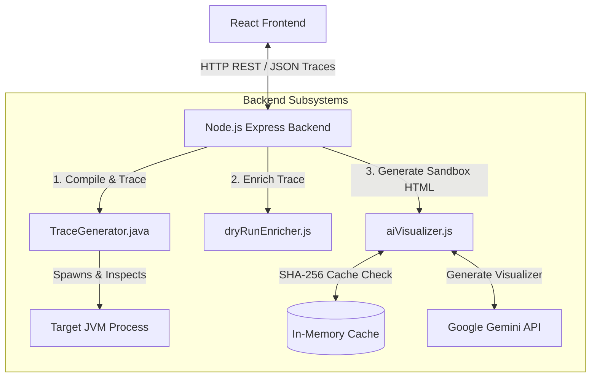
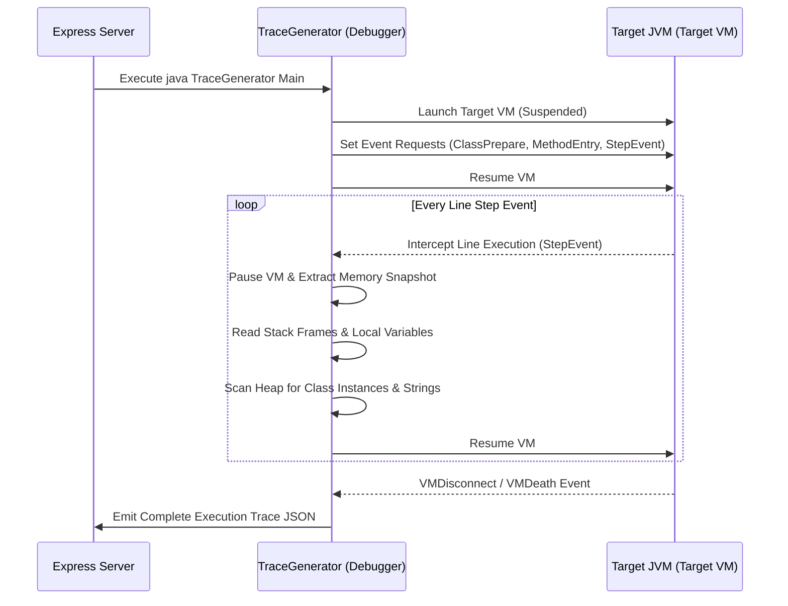
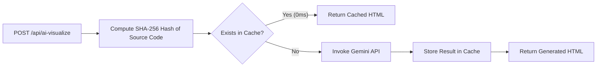
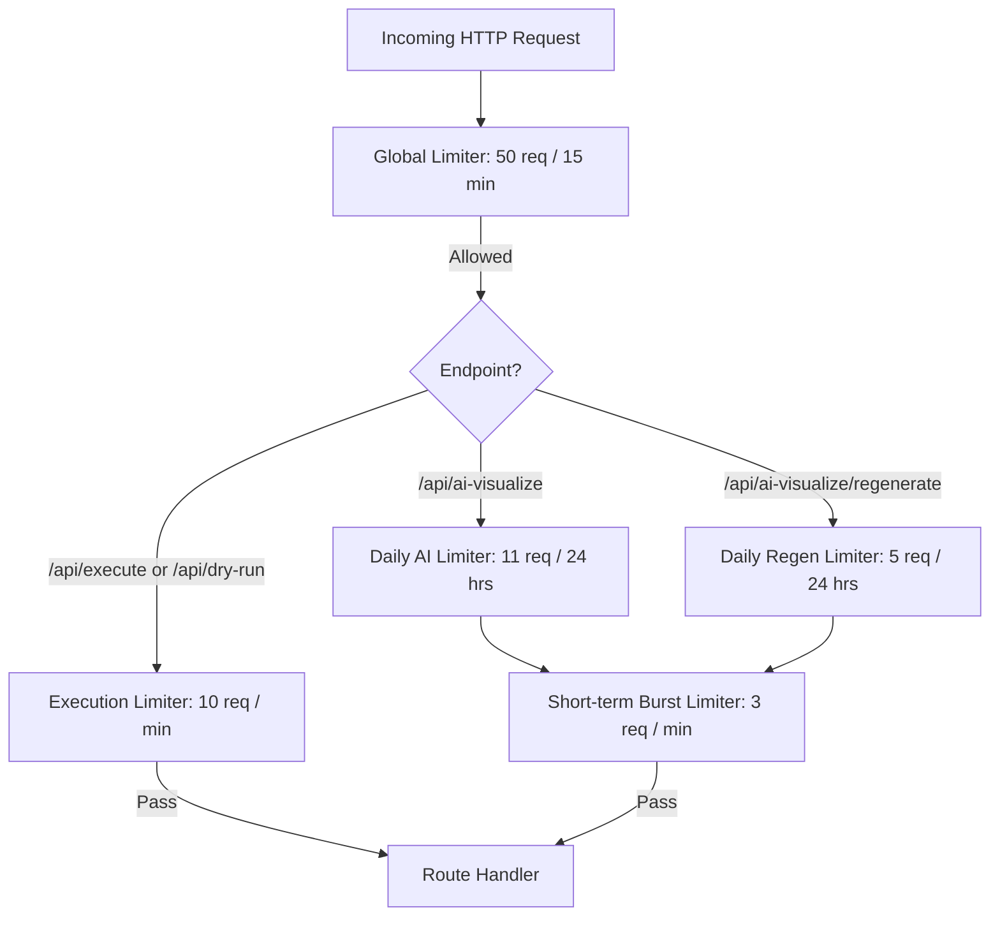

<div align="center">
  
  <p><b>Step-by-Step JVM Execution Engine & Dynamic Algorithm Visualizer</b></p>
</div>

---

## Table of Contents

- [Overview](#overview)
- [System Architecture](#system-architecture)
  - [High-Level Component Interaction](#high-level-component-interaction)
- [JVM Execution & JDI Tracing Engine](#jvm-execution--jdi-tracing-engine)
  - [Tracing Lifecycle & Event Handling](#tracing-lifecycle--event-handling)
  - [Memory State Extraction](#memory-state-extraction)
- [AI Visualization Engine](#ai-visualization-engine)
  - [Pipeline & SHA-256 Caching](#pipeline--sha-256-caching)
  - [Prompt Engineering & State Constraints](#prompt-engineering--state-constraints)
- [Security & Rate Limiting System](#security--rate-limiting-system)
  - [Network-Level IP Tracking](#network-level-ip-tracking)
  - [Quota Configuration & Endpoint Map](#quota-configuration--endpoint-map)
- [Frontend Architecture & UI Engine](#frontend-architecture--ui-engine)
  - [Step Player & Trace Normalizer](#step-player--trace-normalizer)
  - [Resizable Panel System](#resizable-panel-system)
- [Local Development & Setup](#local-development--setup)
- [Project Directory Structure](#project-directory-structure)
- [Authors & Developers](#authors--developers)
- [License](#license)

---

## Overview

**JavaFlow** is an interactive debugging and visualization environment for Java program execution. Unlike static AST parsers or simplified language interpreters, JavaFlow attaches directly to a running Java Virtual Machine (JVM) instance via the **Java Debug Interface (JDI)**. It intercepts bytecode execution line-by-line, capturing exact snapshots of the JVM memory state (Call Stack, Heap Objects, Method Area, String Pool, PC Register, and Active Threads).

Additionally, JavaFlow incorporates an **AI Visualizer Sandbox** powered by Google Gemini that transforms raw execution traces into domain-specific algorithm diagrams (e.g. 2D grid matrix traversals for DFS/BFS, tree structures, sorting arrays, and graph nodes).

---

## System Architecture

JavaFlow uses a client-server architecture with a decoupled Node.js Express backend and a Vite-powered React frontend. Communication between services relies on standard REST APIs and structured JSON trace streams.

### High-Level Component Interaction



---

## JVM Execution & JDI Tracing Engine

The core tracing engine resides in `backend/TraceGenerator.java`. Written using the `com.sun.jdi` specification, it acts as a debugger client that launches and monitors a separate target JVM process.

### Tracing Lifecycle & Event Handling



### Memory State Extraction

At each `StepEvent`, the engine inspects the target VM state:
1. **Call Stack (JVM Stacks)**: Iterates over active stack frames per thread. Extracts primitive values and unique object reference identifiers (`@id`).
2. **Heap Memory**: Leverages `ReferenceType.instances(0)` to track class instances created by the user, recursively inspecting object fields and identifying unreferenced objects eligible for Garbage Collection.
3. **String Pool**: Scans `java.lang.String` reference instances to isolate string literals from standard heap object allocations.
4. **Method Area & PC Register**: Captures loaded class metadata, method signatures, line numbers, and current instruction pointers.

---

## AI Visualization Engine

The AI engine (`backend/aiVisualizer.js`) generates interactive visual representations of algorithm states.

### Pipeline & SHA-256 Caching

To prevent redundant LLM invocations and achieve 0ms response times for recurring code runs, the backend implements cryptographic caching:



When a user triggers **Regenerate**, the request targets `/api/ai-visualize/regenerate`, bypassing the cache check to force a new visualization attempt.

### Prompt Engineering & State Constraints

The AI engine uses an extensive system prompt enforcing strict structural and aesthetic guidelines:
- **Design Tokens**: Enforces dark mode (`#0d1117` surface), 2px border radius, muted monochromatic palettes, and enterprise IDE styling.
- **State Persistence Rules**: Forces the generated JavaScript loop to maintain historical state outside the `onStepChange` listener. This prevents local counters (e.g. `count`) from resetting to `0` when stack frames return to `main()`.
- **Component Tracking**: For graph and grid algorithms (e.g., Number of Islands), the visualizer preserves original cell boundaries and highlights component IDs instead of wiping mutated cells to zero.

---

## Security & Rate Limiting System

To defend backend execution resources and manage Gemini API operational costs, JavaFlow implements IP-based rate limiting via `express-rate-limit`, strict API authentication, and Docker-level sandboxing.

### Secure JVM Execution (Docker Sandbox)
User-submitted Java code is executed inside an ephemeral, unprivileged Docker container. We utilize a strict `seccomp` (Secure Computing Mode) profile and drop all Linux capabilities (`--cap-drop ALL`) to ensure total isolation and prevent Remote Code Execution (RCE) or path traversal attacks, superseding the deprecated Java SecurityManager.

### API Authentication & Frontend Security
- **API Key Verification:** All execution and AI endpoints require a cryptographic `X-API-Key` header matched via constant-time comparison to prevent timing attacks.
- **Content Security Policy (CSP):** The frontend enforces a strict CSP to mitigate Cross-Site Scripting (XSS).
- **Isolated AI Iframe:** The AI Visualizer executes inside a strict `'null'` origin iframe sandbox without `allow-same-origin`, preventing AI-generated code from interacting with the main application.

### Network-Level IP Tracking

All limits are locked strictly to client IP addresses (`req.ip`). This prevents quota evasion through browser switching, Incognito mode, or cookie clearing.



### Quota Configuration & Endpoint Map

| Endpoint | Window | Max Requests | Exposed Headers | Description |
| :--- | :--- | :--- | :--- | :--- |
| `POST /api/execute` | 1 minute | 10 | `RateLimit-*` | Standard JVM compilation & trace execution |
| `POST /api/dry-run` | 1 minute | 10 | `RateLimit-*` | Interactive step-by-step dry run endpoint |
| `POST /api/ai-visualize` | 24 hours | 11 | `RateLimit-*` | Initial AI Visualizer generation |
| `POST /api/ai-visualize/regenerate` | 24 hours | 5 | `RateLimit-*` | Forced cache-bypass visualizer regeneration |
| `GET /api/rate-limit-status` | 24 hours | 11 | `RateLimit-*` | Returns remaining quota on client load |

---

## Frontend Architecture & UI Engine

The frontend is built with React, Vite, and custom CSS design tokens.

### Step Player & Trace Normalizer

The frontend player (`DryRunView.jsx`) consumes execution traces client-side:
- **Trace Normalizer (`traceNormalizer.js`)**: Sanitizes and indexes step objects, resolving heap object references to construct local variable state trees.
- **Trace Analyzer (`traceAnalyzer.js`)**: Computes step deltas to highlight variable mutations between step $N-1$ and step $N$.
- **Local Playback**: Playback controls (Play, Pause, Step Forward/Back, Speed Multiplier) operate on local array memory without network requests.

### Resizable Panel System

The UI uses `react-resizable-panels` to allow customizable view configurations:
- **Left Panel**: Monaco Code Editor (`CodeEditor.jsx`) configured with custom scrollbar behavior and line-hit indicators.
- **Center Panel**: Execution metrics, variable tables, call stack frames, and console output.
- **Right Panel**: AI Visualizer Sandbox (`VisualizerCanvas.jsx` / `AIVisualizerSandbox.jsx`) rendering the generated HTML inside an isolated iframe with bidirectional postMessage support.

---

## Local Development & Setup

### Prerequisites

- **Node.js**: `v16.0.0` or higher
- **Docker**: Required for secure JVM sandboxing execution
- **Google Gemini API Key**: Required for AI visualization features

### 1. Environment Setup

Create a `.env` file inside `backend/`:

```env
PORT=4000
GEMINI_API_KEY=your_gemini_api_key_here
APP_API_KEY=your_secret_api_key_here
```

Create a `.env` file inside `frontend/`:

```env
VITE_API_URL=http://localhost:4000
VITE_APP_API_KEY=your_secret_api_key_here
```

### 2. Backend Installation & Run

```bash
cd backend
npm install
npm start
```

The Express server will start on `http://localhost:4000`.

### 3. Frontend Installation & Run

```bash
cd frontend
npm install
npm run dev
```

The Vite dev server will start on `http://localhost:5173`.

---

## Project Directory Structure

```
jvm-visualizer/
├── backend/
│   ├── aiVisualizer.js        # Gemini API integration & SHA-256 caching
│   ├── dryRunEnricher.js      # Trace enrichment & line mapping logic
│   ├── server.js              # Express API, rate limiters, & route definitions
│   ├── TraceGenerator.java    # JDI Tracing Engine source
│   ├── Main.java              # Execution target wrapper
│   └── package.json
├── frontend/
│   ├── src/
│   │   ├── components/        # Standard memory panel components
│   │   ├── features/
│   │   │   └── dry-run/       # Interactive Dry Run feature module
│   │   │       ├── components/# VisualizerCanvas, RateLimitPopup, Toolbar, etc.
│   │   │       └── engines/   # traceNormalizer.js, traceAnalyzer.js, fingerprinter.js
│   │   ├── App.jsx            # Main app router & layout switcher
│   │   └── main.jsx
│   ├── package.json
│   └── vite.config.js
└── README.md
```

---

## Authors & Developers

- **Avinash Mourya** - [GitHub Profile](https://github.com/iamavinashmourya)
- **Abhinav Chaubey** - [GitHub Profile](https://github.com/abhinavkumar0811)

---

## License

This project is licensed under the MIT License - see the [LICENSE](LICENSE) file for details.
